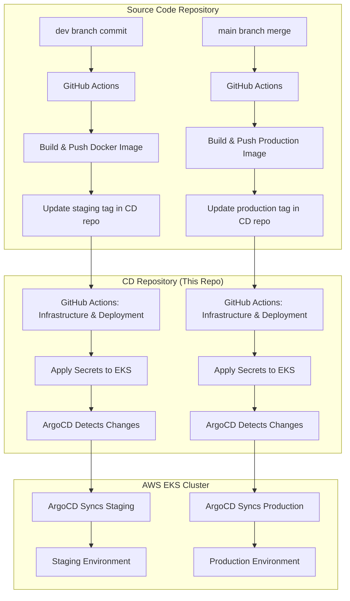

# Welcome to the CD (Continuous Deployment) Repository

This repository contains the deployment configurations and infrastructure-as-code for the UI-Topia Next.js application. It manages automated deployment to AWS EKS clusters using GitOps principles with ArgoCD and GitHub Actions.

## 🏗️ GitOps Architecture



## 📂 Repository Structure

```
├── .github/workflows/deploy.yaml    # GitHub Actions CD pipeline
├── k8s/
│   ├── argocd/
│   │   ├── prod.yaml               # ArgoCD production application
│   │   └── staging.yaml            # ArgoCD staging application
│   └── helm-charts/uitopia-app/
│       ├── templates/              # Kubernetes manifests
│       ├── values-staging.yaml     # Staging values (auto-updated)
│       └── values-production.yaml  # Production values (auto-updated)
├── terraform-eks/                  # EKS infrastructure
│   ├── main.tf
│   ├── vars.tf
│   └── outputs.tf
└── README.md

# Legacy files (kept for reference):
├── ansible/                        # Replaced by GitHub Actions
├── jenkinsfile*                    # Replaced by GitHub Actions
├── k8s/production/, k8s/staging/   # Replaced by Helm charts
```

## 🔧 Environment Configuration

### Infrastructure

- **Cloud Provider**: AWS EKS
- **GitOps Tool**: ArgoCD
- **Infrastructure as Code**: Terraform
- **Package Manager**: Helm

### Staging Environment

- **Namespace**: `staging`
- **Domain**: `staging.benda.wiki`
- **Image Tag**: Auto-updated from source repository

### Production Environment

- **Namespace**: `production`
- **Domain**: `benda.wiki`
- **Image Tag**: Auto-updated from source repository

## 🔐 Security & Secrets Management

### Required GitHub Secrets

| Secret                   | Description                            |
| ------------------------ | -------------------------------------- |
| `AWS_ACCESS_KEY_ID`      | AWS access key for Terraform & kubectl |
| `AWS_SECRET_ACCESS_KEY`  | AWS secret key                         |
| `MONGODB_URI_STAGING`    | MongoDB connection for staging         |
| `MONGODB_URI_PRODUCTION` | MongoDB connection for production      |
| `GOOGLE_ID`              | Google OAuth client ID                 |
| `GOOGLE_CLIENT_SECRET`   | Google OAuth client secret             |
| `NEXTAUTH_SECRET`        | NextAuth session secret                |

### How It Works

- Secrets are applied to Kubernetes namespaces via GitHub Actions
- Staging and production secrets are isolated by namespace
- No sensitive data is stored in Git

## 🚀 Deployment Process

### GitHub Actions Workflow

1. **infrastructure**: Provisions EKS cluster with Terraform (if needed)
2. **manage-secrets**: Applies secrets to staging/production namespaces
3. **verify-deployment**: Checks cluster status and ArgoCD sync

### Trigger Conditions

- **Automatic**: When source repository updates Helm values files
- **Manual**: When terraform files or secrets change
- **Infrastructure**: Only when `terraform-eks/` files change

## 🛠️ Quick Commands

```bash
# Access cluster
aws eks update-kubeconfig --region us-east-1 --name uitopia-eks-cluster

# Check ArgoCD applications
kubectl get applications -n argocd

# View staging/production status
kubectl get all -n staging
kubectl get all -n production

# Access ArgoCD UI
kubectl port-forward svc/argocd-server -n argocd 8080:443
```

## 🔗 Application URLs

- **Staging**: https://staging.benda.wiki
- **Production**: https://benda.wiki
- **ArgoCD**: kubectl port-forward to access UI

---

**Note**: This repository manages deployment configurations. For application source code, see the companion source code repository.
